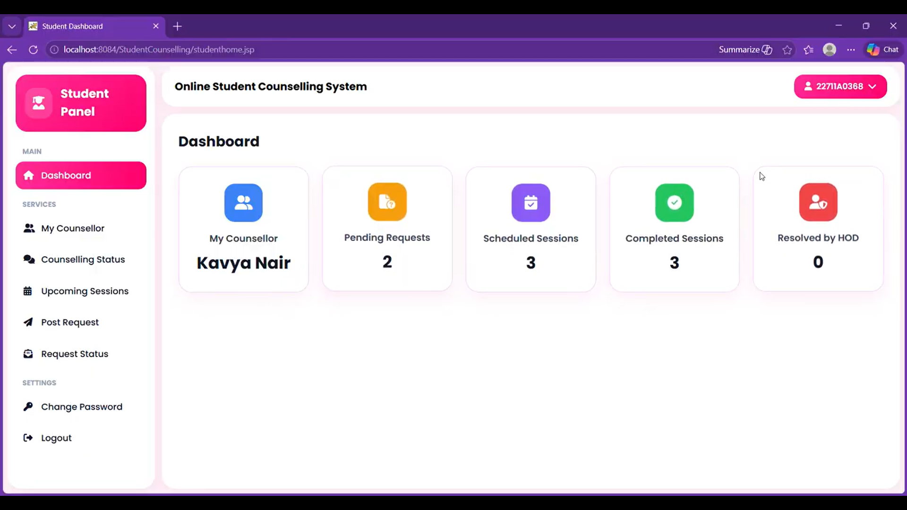
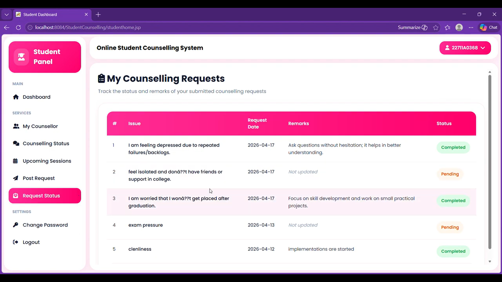
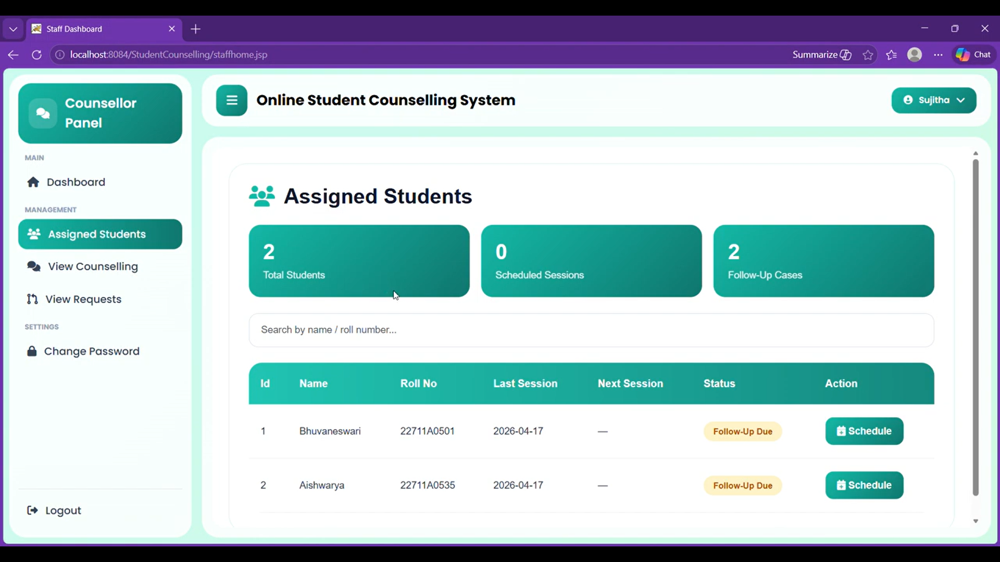
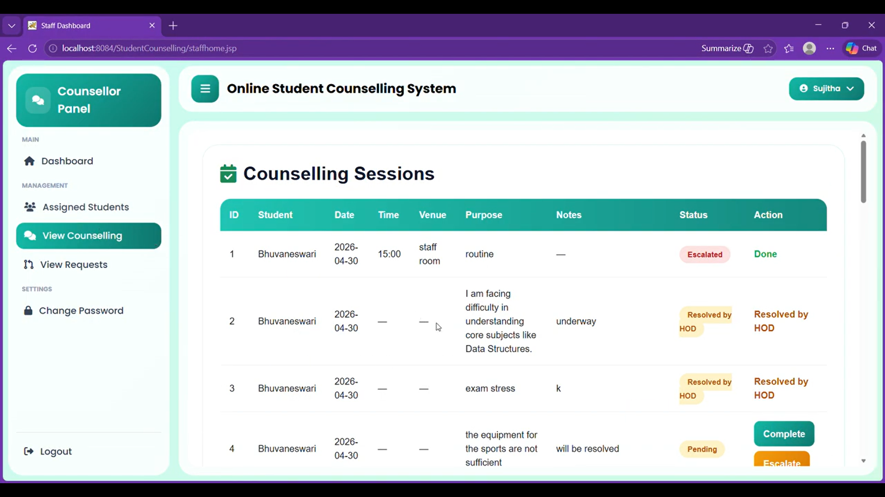
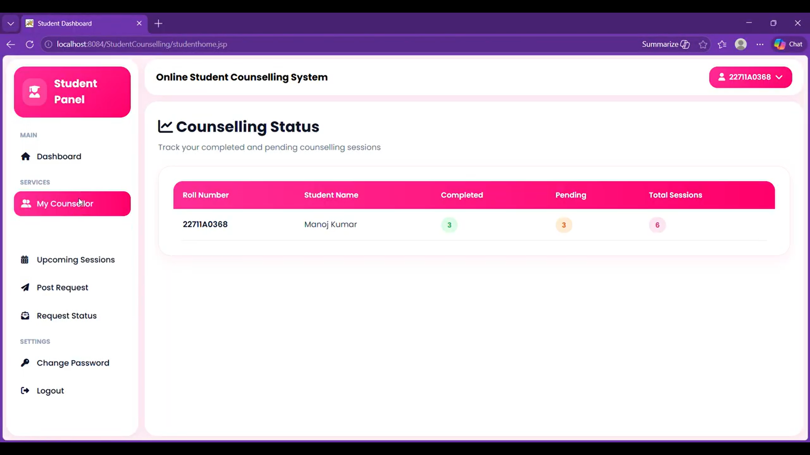

# 🎓 Online Student Counselling System

A web-based counselling management system developed to streamline counselling requests, counsellor assignment, counselling sessions, status tracking, feedback, and escalation of unresolved issues within educational institutions.

## 📌 Features

* 🔐 Role-based authentication and access control
* 👨‍🎓 Student portal for submitting counselling requests
* 👩‍🏫 Faculty/Counsellor portal for managing assigned students and counselling sessions
* 🏫 HOD dashboard for assigning counsellors and monitoring counselling progress
* 👨‍💼 Admin panel for managing departments, students, faculty, and HODs
* 📊 Counselling status tracking and monthly reports
* 💬 Student feedback after counselling sessions
* 🔍 Search and filter functionality
* ⚠️ Escalation of unresolved counselling issues to the HOD
* 📄 Report generation and PDF export

## 🛠️ Tech Stack

### Frontend

* HTML5
* CSS3
* JavaScript
* JSP

### Backend

* Java
* Servlets

### Database

* MySQL

### Development Tools

* NetBeans IDE
* Apache Tomcat
* MySQL Workbench

## 📂 Modules

### 👨‍💼 Admin

* Manage departments
* Manage students
* Manage faculty
* Manage HODs
* View reports

### 🏫 HOD

* Assign students to faculty/counsellors
* Monitor counselling status
* View student feedback
* Handle escalated issues
* Generate reports

### 👩‍🏫 Faculty / Counsellor

* View assigned students
* Conduct counselling sessions
* Update counselling status
* View student details
* Escalate unresolved issues to the HOD

### 👨‍🎓 Student

* Register and login
* Submit counselling requests
* Track counselling request status
* View assigned counsellor
* View counselling sessions
* Submit feedback

## 🚀 Project Workflow

1. Student submits a counselling request.
2. HOD reviews the request and assigns a faculty counsellor.
3. Counsellor conducts the counselling session and updates the status.
4. Student can track the counselling request and session status.
5. Unresolved issues can be escalated to the HOD.
6. HOD reviews and resolves escalated issues.
7. Admin monitors the overall system and generates reports.

## 🖥️ Screenshots

### Figure 1 — Student Dashboard

**Caption:** *Figure 1: Student Dashboard*

### Figure 2 — Post Counselling Request

**Caption:** *Figure 2: Post Counselling Request*

### Figure 3 — Counselling Request Status

**Caption:** *Figure 3: Counselling Request Status*

### Figure 4 — Counsellor Assigned Students

**Caption:** *Figure 4: Counsellor Assigned Students*

### Figure 5 — Counselling Records and Escalation

**Caption:** *Figure 5: Counsellor Counselling Records and Escalation*

### Figure 6 — Counselling Status

**Caption:** *Figure 6: Counselling Status*

## 🎯 Future Enhancements

* Email notifications
* SMS alerts
* Online appointment scheduling
* AI-assisted counselling recommendations
* Analytics dashboard
* Mobile application support

## 👩‍💻 Author

**Lemburu Bhuvaneswari**

Computer Science Graduate | Software Developer

**Interests:** Java, Python, SQL, Data Structures & Algorithms, Web Development

## 📄 License

This project is developed for academic and educational purposes.
